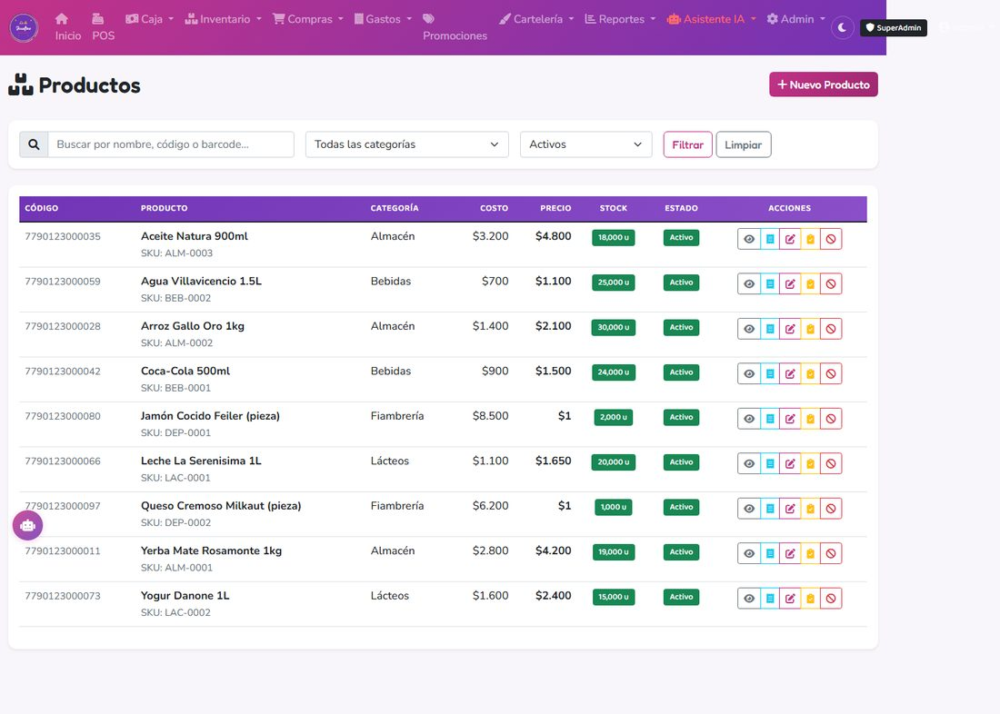
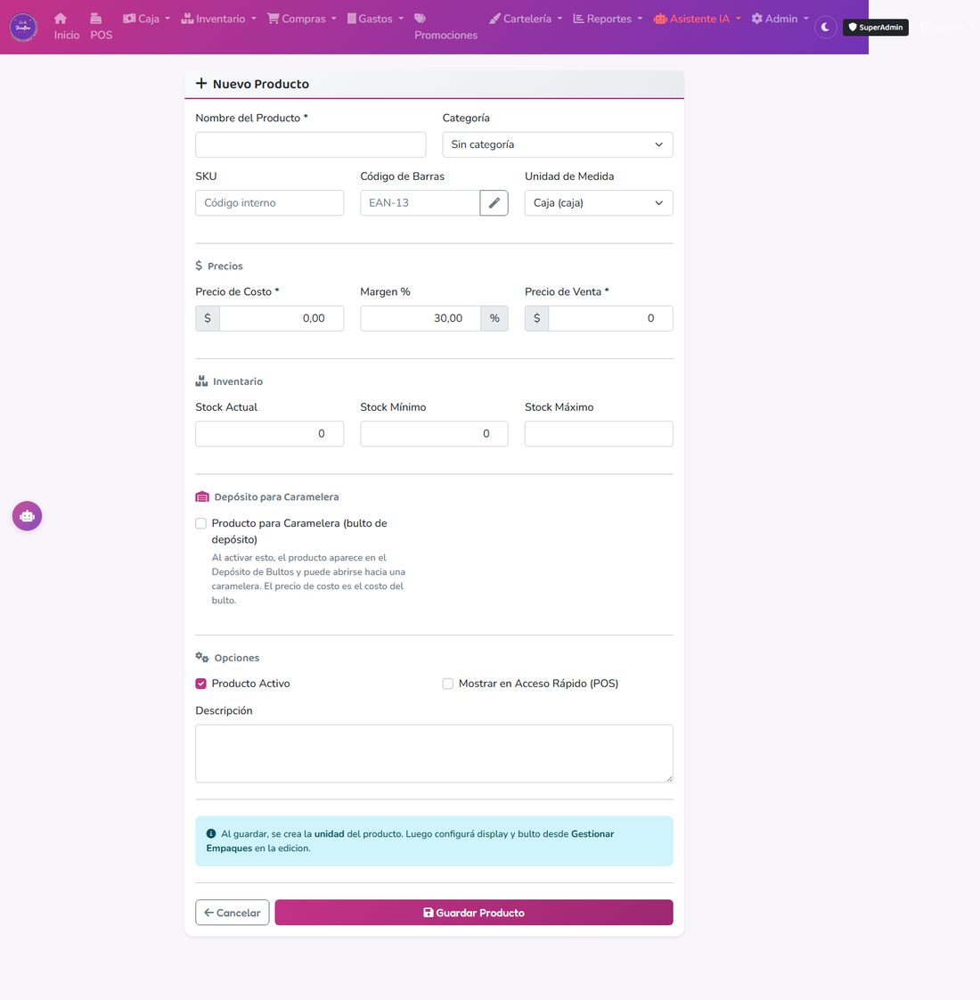
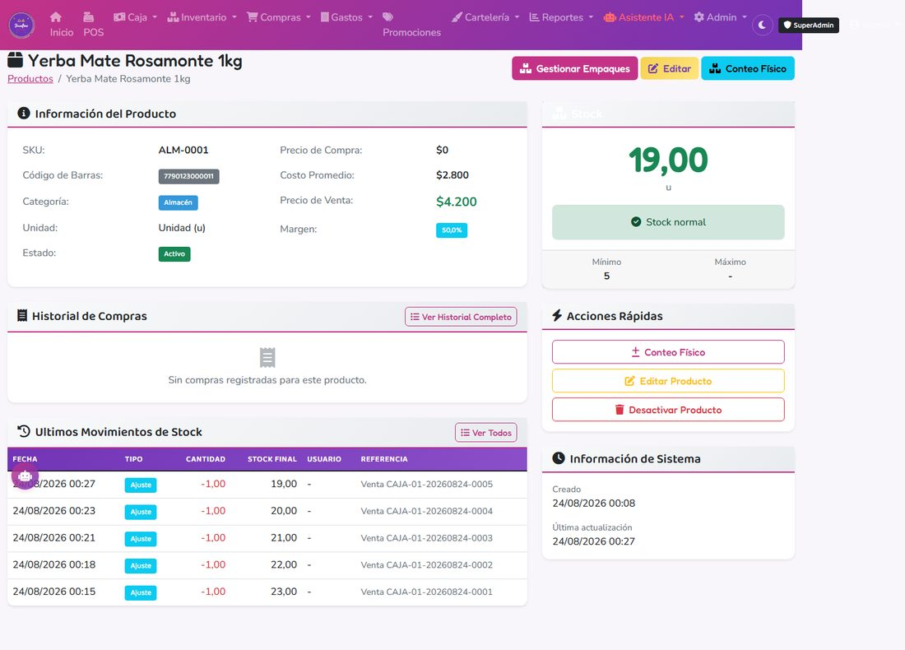

# 1. Crear y modificar productos

## Crear un producto nuevo

### Cuándo usarlo
Cada vez que llega un artículo nuevo que nunca vendiste. Si ya existe, no lo vuelvas a crear — modificá el existente.

### Paso a paso

1. Ir a **Productos → Nuevo Producto**.
2. Completar los datos básicos:
   - **Nombre** (ej: "Yerba Mate 1kg" o "Aceite de Girasol 900ml").
   - **Categoría** (Almacén, Bebidas, Fiambrería, Limpieza, Dietética, etc.). Si no existe, creá una.
   - **Unidad de medida** (Unidad, Gramo, Litro…).
   - **Código de barras** (escaneándolo con la pistola). El sistema alerta si está duplicado.
3. Precios:
   - **Precio de costo:** lo que te cuesta la unidad base.
   - **Precio de venta:** lo que le cobrás al cliente.
4. **Stock inicial:** si ya tenés el producto en el local, poné cuántas unidades tenés. Si no, dejá en 0.
5. **Stock mínimo / máximo:** para alertas de faltante y sobrestock.
6. *(Opcional)* Imagen, color e ícono para el botón del POS.

---

## Configuración de empaques (bulto → display → unidad)

### Cuándo configurarlo
Cuando el producto viene en más de un formato: ej. una caja de conservas trae 4 displays, cada display tiene 6 latas. Así podés vender por unidad, por display o la caja entera, y el sistema lleva el stock sincronizado en los tres niveles.

### Paso a paso

En el mismo formulario de producto, marcá los checkboxes y completá:

**Bulto (tildar "Tiene bulto"):**
- Nombre ("Bulto x144").
- Código de barras propio (distinto al del producto base).
- **Cantidad de Unidades:** unidades totales del bulto (ej: 144).
- **Displays por Bulto:** cuántos displays trae (ej: 12).
- Precio de compra y de venta del bulto.

**Display (tildar "Tiene display"):**
- Nombre ("Display x12").
- Código de barras propio.
- **Unidades por Display:** unidades por display (ej: 12).
- Precio de compra y venta. Si dejaste vacío, se calcula desde el precio del bulto.

**Unidad (tildar "Tiene unidad"):**
- Nombre ("Unidad").
- Código de barras individual (si existe).
- Precio de compra y venta derivados del bulto.

### Qué pasa por atrás

Cuando guardás por primera vez con empaques, el sistema **reparte** tu stock inicial entre los tres niveles automáticamente. Si tenés 288 unidades y el bulto es de 144:

- Unidad: 288
- Display: 288 ÷ 12 = 24
- Bulto: 288 ÷ 144 = 2

Así todos los niveles muestran la misma realidad en su unidad.

---

## Producto a venta por peso (fiambrería, dietética)

### Qué es
Un producto que se vende **por peso** — jamón cocido, queso, salame, dietética a granel. Cada producto de este tipo tiene su propio "depósito" (la pieza/bulto cerrado tal cual llega del proveedor) y su propio "fraccionado" (lo que efectivamente se pesa y vende en el mostrador). Ver el capítulo **4. Venta por Peso** para el detalle completo del flujo.

### Cómo crearlo
1. Desde **Inventario → Venta por Peso → Nuevo Producto Fraccionado**, cargá el nombre (ej: "Jamón Cocido Fraccionado") y los precios:
   - **Precio cada 100g.**
   - **Precio por kilo (oferta):** opcional, se aplica desde 250g en adelante.
2. Por separado, en **Inventario → Venta por Peso → Depósito**, cargás cada pieza/bulto que compras al proveedor (costo y gramos que trae), y lo marcás como producto autorizado para ese fraccionado.

### Particularidades
- **No** usa FIFO: usa **costo promedio ponderado**, que se recalcula cada vez que abrís una pieza nueva hacia el fraccionado.
- Se vende indicando **gramos**, no unidades.
- El precio se calcula proporcional al peso (con reglas distintas arriba/abajo de 250g si tenés precio por kilo).
