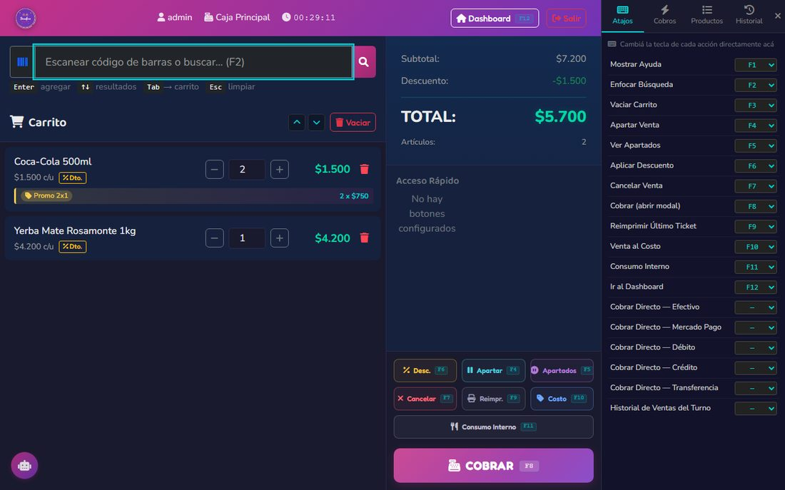
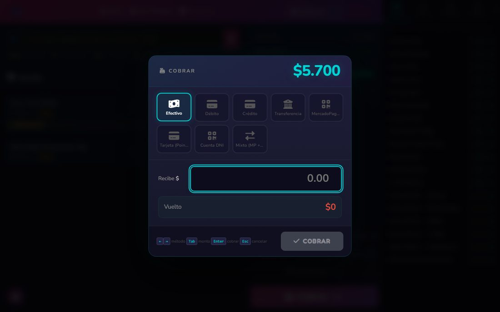
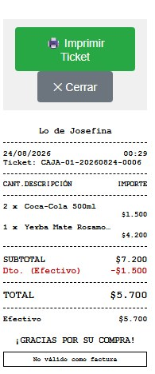

# 3. Vender por el POS (caja)

## Abrir el turno de caja

### Cuándo
Al empezar el día o cambio de cajero. **No podés vender sin turno abierto.**

### Paso a paso

1. Ir a **Caja → Abrir Turno**.
2. Seleccionar la caja (si hay varias).
3. Ingresar el **monto inicial en efectivo** (lo que dejaste como fondo). Contalo antes.
4. Confirmar.

El sistema abre el turno y la sesión de caja. Ya podés vender.

---

## Vender

### Paso a paso

1. Ir a **POS**.
2. Agregar productos:
   - **Escaneándolos** con la pistola.
   - **Buscándolos** por nombre o SKU.
   - **Botones rápidos** (para productos frecuentes).
3. Si el producto se vende **por peso**: el sistema abre un modal pidiendo los gramos.
4. Si querés aplicar **descuento manual**: pulsar el ítem y poner el descuento en $ o %.
5. Las **promociones automáticas** (2x1, combos) se aplican solas al carrito (ver capítulo 9).
6. Pulsar **Cobrar**.
7. Ingresar los métodos de pago: Efectivo, Débito, Crédito, Transferencia, MercadoPago QR, Cuenta DNI (ver capítulo 10 para el detalle de cada uno).
   - Si pagó en efectivo con un billete mayor, el sistema calcula el vuelto.
   - Se puede combinar varios (ej: $1000 efectivo + $500 transferencia).
8. El sistema valida que la suma sea ≥ total. Si es menor, no procesa.
9. Confirmar. Se imprime el ticket.

### Qué pasa por atrás

Cuando confirmás el cobro (todo dentro de una transacción atómica, si algo falla se revierte):

1. Por cada ítem:
   - Si es venta por peso: se descuentan los gramos del producto fraccionado usando el costo ponderado.
   - Si es normal: descuenta stock **en cascada** (unidad, display, bulto) y consume lotes **FIFO** empezando por el más antiguo. El costo real del lote consumido queda guardado en el ítem (sobreescribe el promedio).
2. **Registra los movimientos de caja** por cada pago cobrado (no el vuelto).
3. Marca la venta como completada y genera número de ticket.
4. Imprime el ticket (ancho 58mm).

---

## Pausar una venta

Si un cliente se olvidó algo y querés liberar la caja para otro:

1. Pulsar **Pausar**.
2. La transacción queda pendiente. Podés seguir con la siguiente.
3. Para retomar: **POS → Transacciones Pendientes → Reanudar**.
