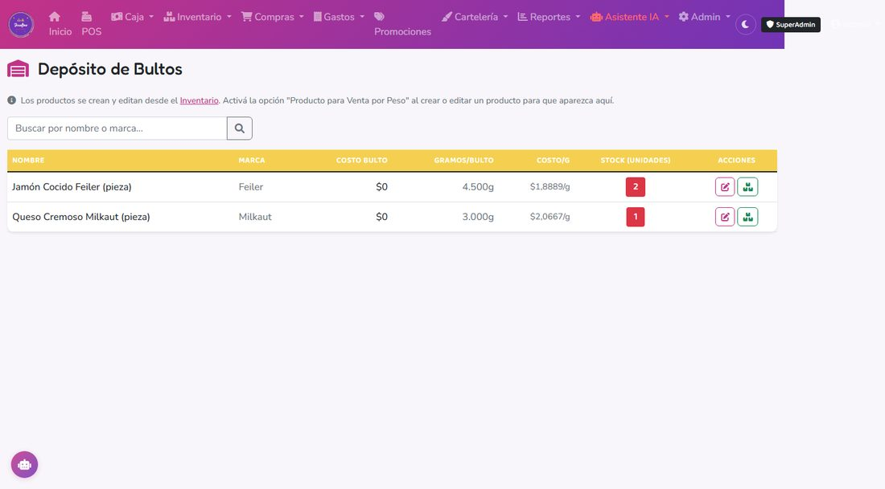
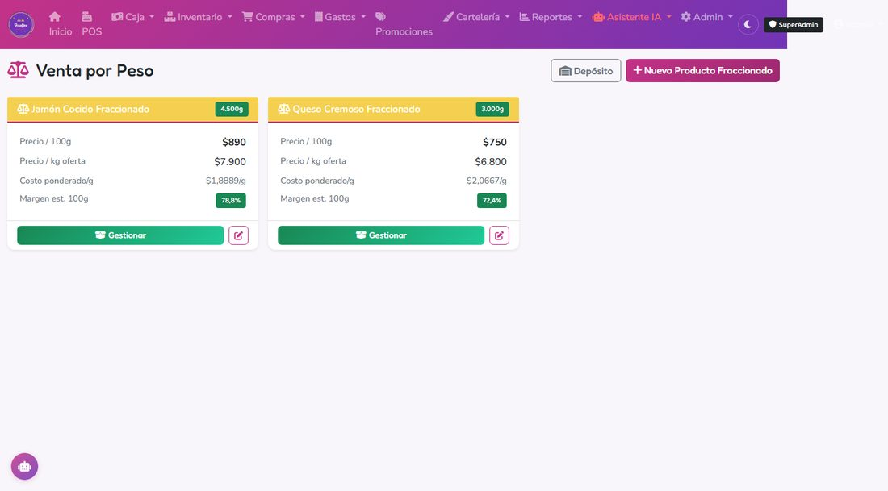
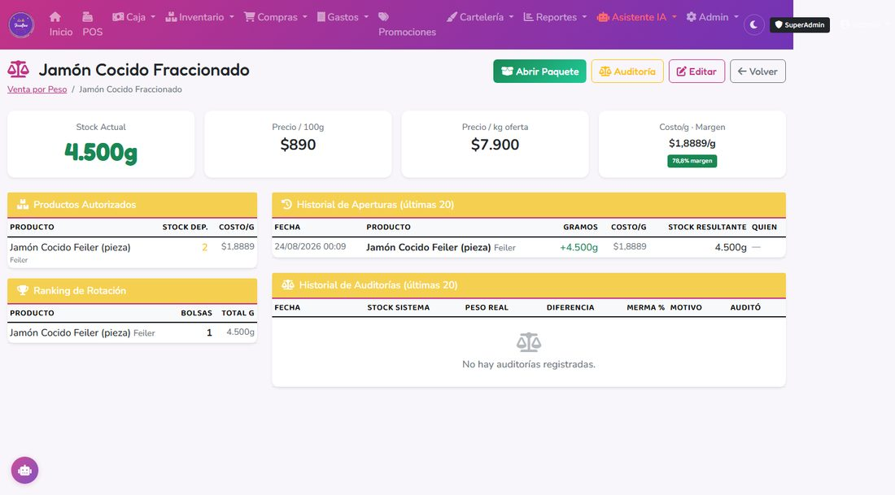

# 4. Venta por Peso (granel)



## Qué es un producto fraccionado

Un **contenedor** (fiambre en la fiambrera, queso, dietética a granel, etc) donde se van agregando bultos que se venden todos al mismo precio por gramo. Ejemplo: "Jamón Cocido Fraccionado", donde vas abriendo distintas piezas/paquetes comprados a distintos proveedores o a distinto precio.

Como los costos son distintos pero el precio de venta es único, el sistema usa **costo promedio ponderado** para calcular la ganancia (no FIFO).



---

## Antes de abrir nada: dar de alta el circuito completo

Son 3 pasos separados, cada uno se hace **una sola vez** por tipo de producto (no hay que repetirlos en cada venta):

### Paso 1 — Cargar la pieza cerrada (el depósito)

Es un producto común de **Inventario → Nuevo Producto**, pero tildando la casilla **"Producto para Venta por Peso (pieza/bulto de depósito)"**. Ahí completás:
- **Marca** (para diferenciar piezas del mismo tipo, ej. dos jamones de distinto proveedor).
- **Gramos por Unidad**: cuánto pesa cada pieza cerrada (ej: 500 para una pata de jamón de 500g).
- **Precio de Costo**: lo que te costó esa pieza. No hace falta cargarle precio de venta — esta pieza no se vende suelta, solo alimenta al producto fraccionado.

### Paso 2 — Cargar el stock de esa pieza

Como a cualquier producto: por **Compras** (recibir una orden de compra) o con un ajuste manual de stock. Acá la cantidad que cargás es **cantidad de piezas**, no gramos (ej: "tengo 3 piezas en la heladera").

### Paso 3 — Crear el producto fraccionado (el que se vende por peso)

En **Inventario → Venta por Peso → Nuevo Producto Fraccionado** (ej: "Jamón Cocido Fraccionado"). Ahí cargás, en la misma pantalla:
- **Precio de venta por 100g**.
- **Precio por Kilo Oferta** (opcional): si vendés una oferta fija por cuarto/250g, cargá acá el precio equivalente a 1 kilo (el precio del cuarto × 4) — el sistema lo aplica proporcional desde los 250g en adelante.
- Qué piezas de depósito (del Paso 1) están **autorizadas** a alimentar este producto.

Recién con los 3 pasos hechos, el producto fraccionado queda listo para el Paso 4: abrir una pieza y empezar a vender por peso.

---

## Abrir un paquete hacia el producto fraccionado

### Cuándo
Cada vez que abrís una pieza/bulto nuevo (ej: una nueva pata de jamón, una nueva horma de queso).

### Paso a paso

1. Ir a **Inventario → Venta por Peso**, entrar al producto.
2. Seleccionar:
   - El **producto de depósito** (el bulto/pieza cerrada).
   - **Cantidad de paquetes** a abrir.
3. Confirmar.



### Qué pasa por atrás

1. Calcula los gramos nuevos: cantidad de paquetes × gramos que trae cada uno.
2. **Recalcula el costo ponderado** del producto fraccionado (ver sección siguiente).
3. Suma los gramos al stock del producto fraccionado.
4. Descuenta el paquete del stock de depósito.
5. Sincroniza el "producto POS" vinculado (para que al escanear/buscar aparezcan los gramos actualizados).

---

## Cómo se calcula el costo ponderado

El sistema **no promedia por cantidad de productos distintos**. Promedia **por gramos**: cada gramo dentro del frasco hereda un costo promedio que refleja de dónde vinieron los gramos que ya había y los que acabás de agregar.

### Fórmula

```
costo_nuevo =  (stock_antes × costo_antes) + (gramos_nuevos × costo_nuevo_pieza)
               ────────────────────────────────────────────────────────────────
                                stock_antes + gramos_nuevos
```

Es decir: **total de plata invertida ÷ gramos totales**.

### Costo por gramo de la pieza que abrís

Se calcula a partir del precio de costo del producto de depósito:

```
costo por gramo de la pieza = costo de la pieza ÷ gramos que trae
```

Ejemplo: pieza de jamón cocido de 500 g que costó $5.000 → $10 por gramo.

### Ejemplo con dos piezas distintas

El producto fraccionado arranca vacío (stock = 0, costo = 0).

**Paso 1 — abrís una pieza de 500 g que costó $5.000:**

- Costo por gramo de la pieza: `5.000 / 500 = $10/g`
- Como no hay gramos previos, el costo ponderado queda directo en **$10/g**.
- Stock: **500 g a $10/g**.

**Paso 2 — abrís una pieza de 900 g que costó $13.500 (otro proveedor, otro precio):**

- Costo por gramo de la pieza: `13.500 / 900 = $15/g`
- Aplicamos la fórmula ponderada:

  ```
  costo =  (500 × 10) + (900 × 15)   =   5.000 + 13.500   =   18.500
           ─────────────────────         ────────────────       ──────
                500 + 900                       1.400            1.400
  ```

- Costo ponderado final: **≈ $13,2143/g**.
- Stock: **1.400 g a $13,21/g**.

### Cosas clave a entender

- **Pondera por gramos, no por unidades**: una pieza de 900 g "pesa" más en el promedio que una de 500 g, aunque sea una sola pieza.
- **Cada apertura recalcula el promedio completo**: los gramos viejos se mezclan con los nuevos y todos pasan a compartir el nuevo costo. No se guardan lotes individuales dentro del producto fraccionado (sí se guarda cada apertura en el historial para auditoría).
- **El POS usa este costo ponderado** para calcular la ganancia de cada venta por peso.
- **Las auditorías de peso no tocan el costo ponderado** — solo ajustan gramos (merma/sobrante). Si vendés 200 g después del paso 2, los 1.200 g restantes siguen a $13,21/g; cuando abras otra pieza, se promedia contra esos 1.200 g × $13,21.

---

## Vender por gramos en el POS

1. En el POS, buscá el producto fraccionado (o escaneá su código asociado).
2. Se abre el modal: ingresá los **gramos** a vender.
3. El sistema calcula el precio:
   - < 250g → proporcional al precio cada 100g.
   - ≥ 250g con **precio kilo oferta** activo → se aplica la regla de tres sobre el precio del kilo.
4. Seguí con el cobro normal.

---

## Auditoría de merma

### Cuándo
Periódicamente (una vez por semana recomendado) o cuando sospéches diferencias.

### Paso a paso

1. **Pesar físicamente** el producto en la balanza.
2. Entrar al detalle del producto fraccionado → botón **Auditoría**.
3. Ingresar el **peso real en gramos** medido.
4. (Opcional) Notas: causa probable (humedad, derrame, robo).
5. Confirmar.

### Qué pasa por atrás

1. Calcula la diferencia entre el stock del sistema y el peso real.
2. Guarda la auditoría con el % de merma y la fecha.
3. **Ajusta automáticamente** el stock del producto fraccionado al peso real.
4. Queda registrada en el historial — podés ver todas las auditorías en el detalle del producto.

Esto te permite detectar robos o desvíos sistemáticos.
