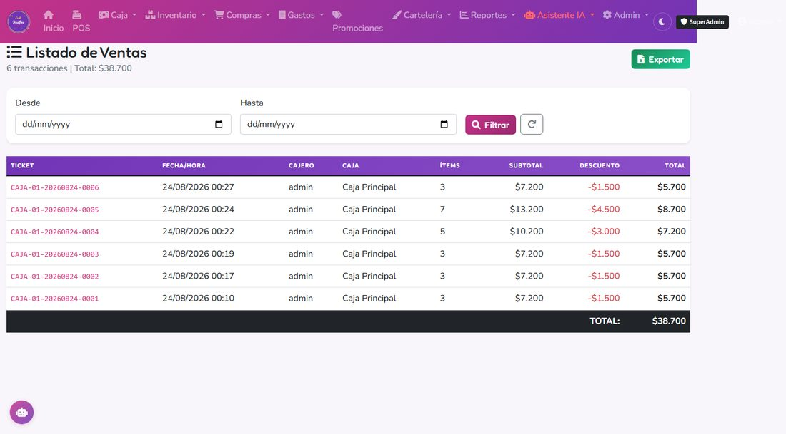
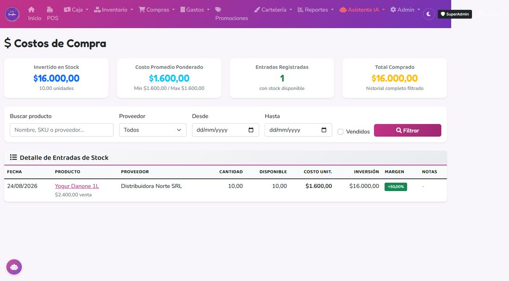

# 7. Reportes

## Reportes disponibles

### Ventas por POS
- Dónde: **Reportes → Ventas**.
- Filtros: rango de fecha, método de pago, cajero, caja.
- Muestra: tickets con detalle, total por período, desglose por método.

### Stock bajo
- Dónde: **Productos → Filtro "Stock bajo"**.
- Muestra productos donde el stock actual llegó o bajó del mínimo configurado.
- Sirve para armar la próxima OC.

### Movimientos de stock (Kardex)
- Dónde: **Productos → [Producto] → Movimientos**.
- Historial completo de entradas y salidas.
- Filtros: tipo, motivo, fecha.

### Historial de costos y ganancia
- Dónde: **Productos → Historial de costos**.
- Muestra lotes activos/agotados con su precio de compra, cantidad remanente y margen estimado.
- Útil para ver qué producto tiene mejor rentabilidad.

### Cierre de caja
- Dónde: **Caja → Historial**.
- Cada cierre con su detalle, diferencia y desglose por método.

### Venta por Peso
- Dónde: **Inventario → Venta por Peso → [Producto] → Gestionar**.
- Muestra: stock en gramos, costo ponderado actual, historial de aperturas, historial de ventas con margen y auditorías.

### Vencimientos
- Dónde: **Inventario → Vencimientos**.
- Muestra los lotes con stock que están vencidos o vencen pronto, clasificados por color (rojo = vencido, amarillo = vence pronto, azul = próximo). Ver capítulo 8 para el detalle completo.

### Gastos
- Dónde: **Finanzas → Gastos**.
- Ingresan automáticamente las compras recepcionadas (categoría "Proveedores") y manualmente servicios, sueldos, etc.

---

## Ganancia: promedio vs FIFO real

El reporte de ganancia usa el **costo FIFO real** capturado al momento de la venta (el costo del lote consumido). Esto significa:

- Si compraste 10 unidades a $100 (lote A) y 10 a $200 (lote B), y vendés 5 a $300, la ganancia es (300 − 100) × 5 = **$1.000**, no (300 − 150) × 5 = $750 (el promedio).
- Al vender las siguientes que mezclen lotes, el sistema calcula el promedio del costo **solo de lo consumido en ese ticket**.

Excepción: los productos de venta por peso, que usan costo promedio ponderado de todo el fraccionado.

---

## Cómo exportar

La mayoría de los listados tienen botón **Exportar a CSV/Excel**. Para reportes complejos o cruces entre módulos, pedile al administrador que arme la consulta.
