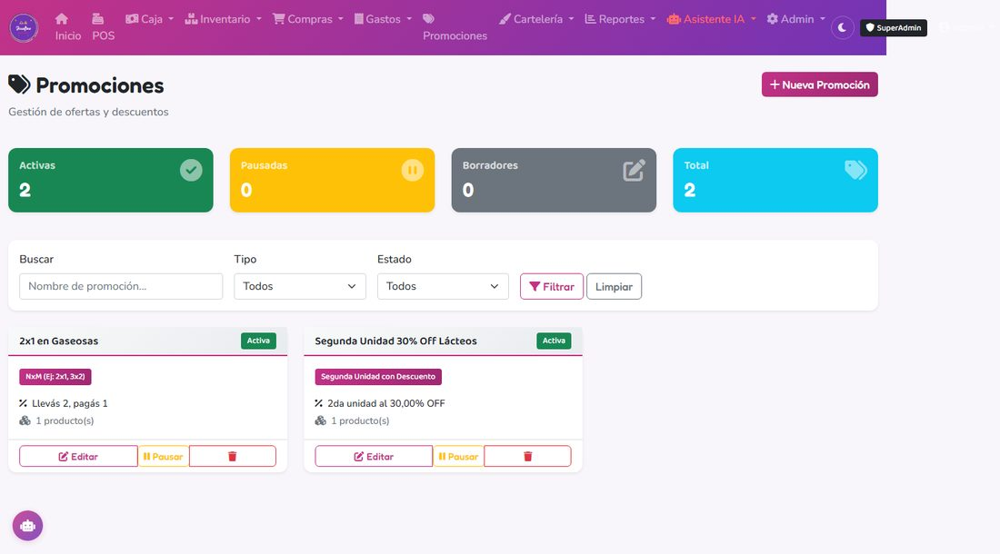
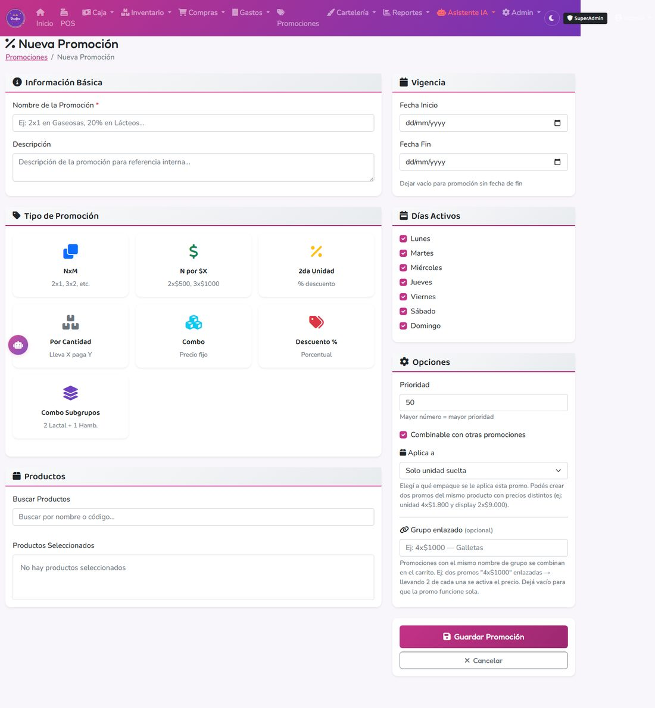

# 9. Promociones

## Qué es

Descuentos automáticos que se aplican solos en el carrito del POS cuando el cliente lleva los productos que corresponden — la cajera no tiene que acordarse de aplicar nada a mano.

---

## Crear una promoción

### Paso a paso
1. Ir a **Promociones → Nueva Promoción**.
2. Ponerle un **nombre** claro (ej: "2x1 Gaseosas 500ml") — es lo que va a aparecer en el ticket.
3. Elegir el **tipo de promoción** (ver abajo cuál usar para cada caso).
4. Elegir los **productos** a los que aplica.
5. Configurar fechas de validez (opcional — si la dejás vacía, no vence), días de la semana en que está activa, y horario (opcional).
6. Guardar y pasar el estado a **Activa** para que empiece a aplicarse en el POS.

---

## Qué tipo elegir según lo que querés armar

### 2x1, 3x2 (llevás varios, pagás menos)
Tipo: **NxM**. Configurás "Cantidad Requerida" (ej: 2) y "Cantidad Cobrada" (ej: 1). El cliente lleva 2, paga 1.

### Segunda unidad con descuento (ej: "50% en la 2da unidad")
Tipo: **Segunda Unidad con Descuento**. Configurás el porcentaje de descuento que se aplica a partir de la segunda unidad del mismo producto.

### Combo a precio fijo (ej: "2 fiambres a elección por $X")
Tipo: **N por Precio Fijo**. Elegís cuántas unidades entran en el combo y el precio final fijo, sin importar cuáles de los productos habilitados elija el cliente.

### Combo con productos de dos categorías distintas (ej: "2 panes + 1 hamburguesa")
Tipo: **Combo por Subgrupos**. Armás dos grupos de productos (Subgrupo A y Subgrupo B), cada uno con su cantidad requerida, y un precio fijo total. El cliente puede elegir cualquier combinación dentro de cada subgrupo.

### Descuento simple por cantidad o por monto
Tipos: **Descuento por Cantidad** o **Descuento Porcentual** — para casos más simples, tipo "10% de descuento a partir de 3 unidades" sin armar un combo.

---

## Un consejo importante

Si tenés muchas variantes de un mismo producto (por ejemplo, distintas marcas o gustos de yogur), cargar una promoción por cada variante es tedioso. Conviene **agrupar los productos por marca o variedad** al elegir a cuáles aplica la promo, en vez de crear una promoción separada por cada código de barras.

---

## Restricciones opcionales

Cada promoción puede además limitarse por:

- **Empaque:** solo unidad suelta, solo display, solo bulto, o cualquiera.
- **Monto mínimo de compra.**
- **Máximo de usos por venta** (0 = sin límite).
- **Combinable o no** con otras promociones activas al mismo tiempo.
- **Prioridad:** si dos promociones aplican al mismo producto, se usa la de mayor prioridad.

### Qué pasa por atrás

En el checkout, el sistema evalúa todas las promociones activas contra el carrito y aplica automáticamente las que correspondan, respetando prioridad y combinabilidad. El descuento aplicado queda guardado en el ticket, ítem por ítem, para que el reporte de ventas muestre el precio real cobrado.
