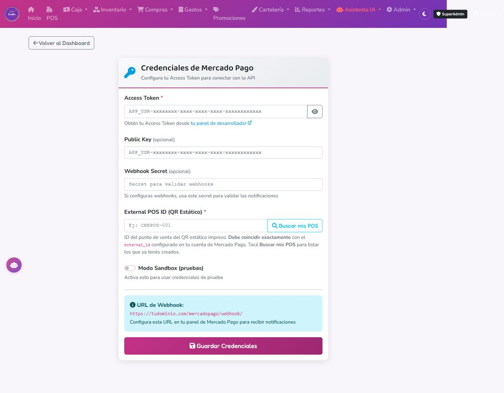

# 10. Medios de pago

## Los medios de pago disponibles

El sistema viene con seis métodos ya cargados: **Efectivo, Débito, Crédito, Transferencia, MercadoPago QR y Cuenta DNI.** Se usan igual en el cobro del POS y se discriminan por separado en el cierre de caja (capítulo 6).

Solo **Efectivo** afecta el conteo físico de la caja. Todos los demás son "cuentas aparte" — el sistema los suma en el reporte pero no esperás ver esa plata en el cajón.

---

## MercadoPago QR (automático)

### Qué hace
Genera un código QR en el momento del cobro. El cliente lo escanea desde la app de Mercado Pago, paga, y el sistema **detecta el pago solo** (consulta cada pocos segundos + confirmación de respaldo) y cierra la venta automáticamente, sin que nadie tenga que confirmar nada a mano.

### Configuración (una sola vez)
1. Necesitás **tu propia cuenta de Mercado Pago** vinculada al negocio (no se puede compartir la de otro comercio).
2. Ir a **MercadoPago → Credenciales**.
3. Cargar el **Access Token** y la **Public Key** de tu cuenta (se consiguen desde el panel de desarrolladores de Mercado Pago, con tu usuario).
4. Guardar.

Desde ese momento, "MercadoPago QR" en el cobro del POS queda operativo.

### Comisión
Mercado Pago cobra una comisión chica por cada cobro con QR. Es plata que se resta de lo que te acredita, hay que contemplarla en el margen.

---

## Cuenta DNI (manual, sin comisión)

### Qué es
La opción de cobro de Banco Provincia. **No requiere ningún aparato ni conexión con el sistema** — la cajera cobra con la app "Cuenta DNI Comercios" desde su celular (o el QR impreso en el mostrador) y después registra el pago en el POS.

### Cómo usarla
1. Descargar la app **"Cuenta DNI Comercios"** y generar el QR del local (una sola vez, no hay que hacerlo en cada venta).
2. Al cobrar, el cliente escanea ese QR desde su Cuenta DNI y paga.
3. En el POS, seleccionar **"Cuenta DNI"** como método de pago y confirmar que la plata llegó.

### Por qué es manual
A diferencia de Mercado Pago, conectar Cuenta DNI para que el sistema detecte el pago solo requiere darse de alta como comercio integrador ante Banco Provincia/Red Link — es un trámite aparte que no está resuelto todavía. Mientras tanto, se usa igual que una transferencia: la cajera confirma a mano cuando ve que entró la plata.

### Ventaja
**No tiene comisión**, a diferencia de Mercado Pago QR.

---

## Transferencia bancaria (manual)

Igual que Cuenta DNI: la cajera selecciona "Transferencia" en el cobro y confirma cuando ve la notificación de que llegó la plata a la cuenta del banco. Sin comisión.

### Tip práctico
Tener siempre a mano el celular o una computadora con las notificaciones del banco/Mercado Pago activadas en el mostrador, para no tener que ir y volver a confirmar cada pago.

---

## Débito, Crédito

Se registran igual que cualquier otro método — se selecciona en el cobro y se ingresa el monto. No hay integración automática con la terminal de tarjetas; el POS solo lleva el registro de cuánto se cobró por ese medio.
